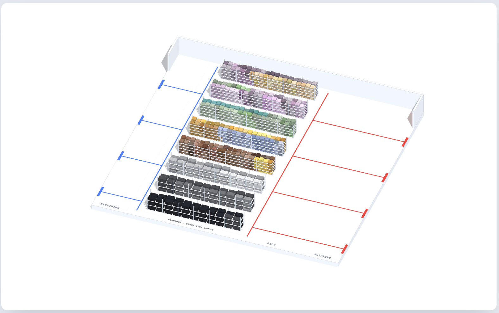

# Design Specs

> **Owner:** Design · **Status:** Draft · **Last updated:** 2026-10-08

## Purpose
How the 3D warehouse looks. Part 1: the floor and the racks. Docks, trucks, pallets, and cards come later.
Reference: mockup **2a, Flagship bulk zone**.

## Scene basics
- **Units:** 1 = 1 meter. Origin = floor center, on the floor surface.
- **Axes:** `x` runs the long way (receiving → shipping). `z` runs front → back. `y` is up.
- **Camera:** orthographic, fixed angle from the front-left, aimed at the floor center. Zoom so the floor fits with 10% margin. No orbit in v1 (OPEN-D3).
- **Light:** soft hemisphere light plus one directional light from above-left. Box tops read lighter than box sides. No cast shadows in v1.
- **Materials:** matte (roughness 1). Flat, clean, no textures.

## Colors
| Token | Hex | Used for |
|-------|-----|----------|
| `page` | `#E4E8F0` | Page background |
| `card` | `#FFFFFF` | Card behind the canvas |
| `floor` | `#FFFFFF` | Floor top |
| `floorEdge` | `#E1E6F0` | Floor sides |
| `wall` | `#EDF2FB` (70% opacity) | Walls |
| `rackFrame` | `#D7DCE5` | Rack uprights and shelves |
| `inbound` | `#4677EE` | Receiving lines and docks |
| `outbound` | `#E5463C` | Pack lines and shipping docks |
| `label` | `#8A8F99` | Floor text |

## Floor

### Plate and walls
- Floor plate: 40 long (`x`). Depth (`z`) = `racks × 2.8 + 4`. Eight racks → 26.4, like the mockup.
- Floor thickness 0.3. Top `floor`, sides `floorEdge`.
- Back wall: full length, 3 high, 0.2 thick, `wall`.
- Side returns: a 4-long wall at each back corner, same style. The front stays open.

### Zones (left to right along `x`)
| Zone | From `x` | To `x` | Edge line |
|------|---------:|-------:|-----------|
| Receiving | −20 | −13 | Blue line at `x = −13`, front to back |
| Storage (racks) | −12 | 4 | — |
| Pack | 5 | 20 | Red line at `x = 5`, front to back |

- **Docks:** 4 blue docks on the left edge, 4 red on the right edge, spread evenly along `z`. Each dock: a bar 1.6 long, 0.3 wide, 0.1 high.
- **Lanes:** a line from each dock straight along `x` to its zone line. Blue on the left, red on the right.
- **Lines:** 0.06 wide, flat on the floor, raised 0.005 to avoid flicker.

### Floor labels
- Text lies flat on the floor, along the front edge: `RECEIVING`, `FLAGSHIP · DEATH WISH COFFEE`, `PACK`, `SHIPPING`.
- Uppercase, monospace, wide letter-spacing, size 0.35, color `label`.
- Drawn with drei `<Text>`. Exception to the DOM rule: these are floor markings, not content.

## Racks

### Data
| Input | Source | Drives |
|-------|--------|--------|
| Products and variants | `GET /api/products` | Rack rows, colors, order |
| `onHand` per variant | `GET /api/inventory?locationId=loc-1` | Number of boxes |

`onHand`, not `available`: committed stock is still physically on the shelf.

### Layout rule
- **One rack row per product.** Rows = number of products.
- **Row order:** by `category`, then `title`. Row 1 is at the front.
- **Inside a row:** variants split the 10 bays evenly, in `sku` order. Two variants → 5 bays each.
- **Positions never move with stock.** A variant keeps its block. Only the box count changes.

### Rack geometry
| Part | Size |
|------|------|
| Row length | 16 (10 bays × 1.6) |
| Row depth | 1.2 |
| Aisle between rows | 1.6 (row pitch 2.8) |
| Levels | 4, each 0.5 high (rack height 2.1) |
| Slots | 2 boxes per bay per level → 8 per bay |
| Box | 0.7 wide × 0.4 high × 0.9 deep |
| Frame | Uprights 0.05 square at each bay edge, shelf plates 0.03 thick, `rackFrame` |
| End cap | A grey triangular plate on the left end of each row |

### Boxes
- **Boxes per variant** = `min(⌈onHand / 6⌉, slots in its block)`. 6 units = 1 box.
- **Fill order:** bay by bay from the left, each bay bottom level first. The filled run reads like a bar: longer run, more stock.
- **Empty slots:** nothing drawn. The bare shelf shows.

### Box colors
- Each product gets one hue from the palette, in row order:
  `#A98DB5` mauve · `#E3C48E` tan · `#9CB98F` sage · `#7DB5AE` teal · `#E6AE5B` amber · `#9FAEDC` periwinkle · `#8E6248` cocoa · `#5B5E64` graphite
- Variants are shades of that hue. Variant `i` of `n` shifts lightness by `12 × (i − (n − 1)/2)` points. Two variants → −6 and +6.
- The legend uses the same function (`lib/colors.ts`), so legend and racks always match.

### Example (seed start values)
| Row | Product | Variant · onHand | Boxes |
|----:|---------|------------------|------:|
| 1 | Death Wish Ground Coffee | DW-GRD-1LB · 240 | 40 (block full) |
| | | DW-GRD-5LB · 60 | 10 |
| 6 | Skull Mug | MUG-BLK · 60 | 10 |
| | | MUG-WHT · 36 | 6 |

## Open items
- **OPEN-D1:** The mockup packs different products into one row. This spec gives each product its own row, so racks never reshuffle when stock changes. Keep the spec or match the mockup?
- **OPEN-D2:** A real store has hundreds of products. One row each won't fit. Group by category, paginate, or show top sellers?
- **OPEN-D3:** Fixed camera or orbit controls?
- **OPEN-D4:** Stock above a block's capacity. Cap silently, or show a "full" marker?

## Depends on
[Architecture](03-architecture.md) · [Warehouse API](api.md) · [Seed Data](06-seed-data.md)